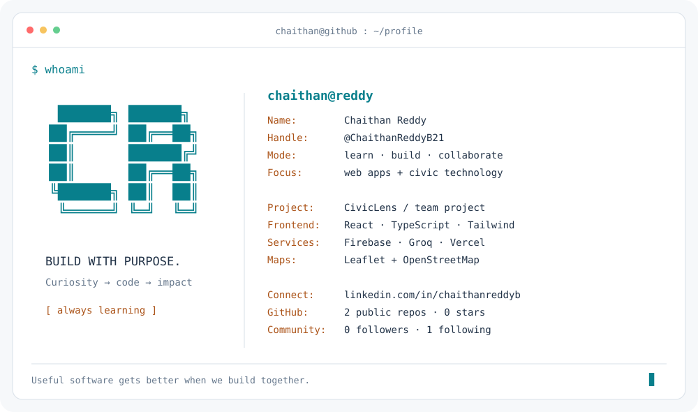

<picture>
  <source media="(prefers-color-scheme: dark)" srcset="dark_mode.svg">
  <source media="(prefers-color-scheme: light)" srcset="light_mode.svg">
  
</picture>

  <a href="https://workspace-sandy-beta.vercel.app/">CivicLens ↗</a>
  &nbsp; · &nbsp;
  <a href="https://github.com/preethamreddy2007/Civiclens">Project source</a>
  &nbsp; · &nbsp;
  <a href="https://www.linkedin.com/in/chaithanreddyb/">LinkedIn</a>

### Hey, I'm Chaithan 👋

I enjoy turning ideas into useful web experiences and learning through collaboration. Currently building **CivicLens with my project team**, exploring how maps, data, and AI can make public information easier to understand.

### Featured build — CivicLens

**A group project for exploring public infrastructure.** Browse projects, budgets, departments, progress, and news through a shared dashboard, with interactive maps and an AI assistant.

`React` · `TypeScript` · `Vite` · `Tailwind CSS` · `Firebase` · `Leaflet` · `Groq` · `Vercel`

[Explore the live website →](https://workspace-sandy-beta.vercel.app/) &nbsp; [Meet the code →](https://github.com/preethamreddy2007/Civiclens)

---

Terminal layout inspired by <a href="https://github.com/Andrew6rant">Andrew6rant</a>; artwork and implementation created for this profile. Public GitHub statistics refresh daily.

